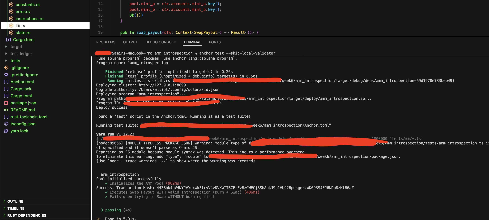

# AMM Instruction Introspection

<div align="center">
  
</div>

## Overview

This repository implements a Solana smart contract demonstrating **Instruction Introspection** within an Automated Market Maker (AMM). It completes **Challenge Option 2** for the Turbin3 Week 6 Assignment.

The core objective is to ensure that a token payout (Swap) only occurs if the user has successfully executed a token `Burn` instruction in the exact same transaction, immediately preceding the payout instruction.

## System Architecture

The program leverages the native `sysvar::instructions::ID` account to safely peek into the transaction's instruction sequence.

### Core Mechanisms

The program features two main instructions:
1. `initialize_pool`: Provisions the AMM pool, configuring the allowed token mints (Mint A and Mint B) and establishing the vault authority via a Program Derived Address (PDA).
2. `swap_payout`: The introspective instruction that validates the user's prior actions and processes the swap.

### Introspection Logic (`swap_payout`)

Instead of accepting tokens directly within the instruction, the `swap_payout` instruction requires the user to submit an SPL Token `Burn` instruction just before it. 

The `swap_payout` logic performs the following strict security validations:
* **Instruction Index Verification**: Loads the current instruction index and retrieves the immediately preceding instruction.
* **Program ID Validation**: Ensures the preceding instruction was executed by the official SPL Token Program.
* **Discriminator Check**: Validates that the instruction data begins with `8` (the SPL Token `Burn` discriminator).
* **Payload Decoding**: Decodes the 8-byte LE integer representing the burned token amount.
* **Context Verification**:
  * Ensures the burned token corresponds to the expected `Mint A`.
  * Verifies the burn authority matches the user attempting the swap.
* **Execution**: If all validations pass, the program initiates a Cross-Program Invocation (CPI) to transfer the equivalent decoded amount of `Mint B` from the AMM Vault to the user's Associated Token Account (ATA).

## Testing & Validation

The test suite is written in TypeScript using `@coral-xyz/anchor` and `ts-mocha`. 
Tests bypass the built-in validator to simulate a live environment natively.

```bash
# In one terminal, initialize a local ledger
solana-test-validator --reset

# In the project terminal, execute the test suite
anchor test --skip-local-validator
```

### Test Coverage
- `[✔] Initializes the AMM Pool`: Verifies proper PDA generation and vault provisioning.
- `[✔] Executes Swap Payout WITH valid Introspection (Burn + Swap)`: Simulates a frontend composing a standard Token Program `Burn` instruction immediately followed by the `swap_payout` instruction. Verifies accurate token balances post-swap.
- `[✔] Fails when trying to Swap WITHOUT burning first`: Ensures the contract securely reverts the transaction with a custom `NoPriorInstruction` or `InvalidInstructionData` error if the burn constraint is violated.

## License
ISC
